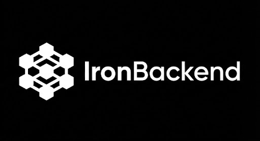

# IronBackend

<div align="center">



**Backend Architecture Intelligence for AI Coding Assistants**

[](https://www.npmjs.com/package/@ironbackend/cli)
[](./LICENSE)
[](./CONTRIBUTING.md)

*A senior backend architect embedded inside your AI, installable via npm.*

</div>

---

## What is IronBackend?

IronBackend is a **backend-focused architecture knowledge base** designed to inject production-grade architectural intelligence into AI coding assistants like **Cursor**, **Claude**, **GitHub Copilot**, and **ChatGPT**.

### It is NOT:
- ❌ A framework or library
- ❌ A runtime dependency
- ❌ A code generator
- ❌ A tutorial or course

### It IS:
- ✅ A backend architecture knowledge base
- ✅ A style & stack selector for AI assistants
- ✅ A rule-driven prompt injection system
- ✅ Distributed via npm CLI

---

## Why IronBackend?

Modern AI coding assistants lack structured backend architectural knowledge:

| Problem | IronBackend Solution |
|---------|---------------------|
| Inconsistent architecture advice | 10 production-grade architecture styles |
| Framework-specific suggestions | Stack-agnostic patterns with stack-specific conventions |
| No design principle enforcement | 50+ enforceable design rules |
| Ad-hoc security patterns | Security & reliability playbooks |

---

## Quick Start

### Installation

```bash
# Install globally
npm install -g @ironbackend/cli

# Or use with npx
npx @ironbackend/cli init cursor
```

### Initialize for Your AI Tool

```bash
# Initialize for a specific AI tool
ironbackend init cursor       # Cursor IDE
ironbackend init claude       # Claude Code
ironbackend init copilot      # GitHub Copilot
ironbackend init antigravity  # Antigravity

# Interactive mode (select tool from menu)
ironbackend init

# With style and stack pre-selected
ironbackend init cursor --style clean-monolith --stack node-nestjs
```

### Configure Architecture

```bash
# List available options
ironbackend list

# Select architecture style
ironbackend select style hexagonal

# Select tech stack
ironbackend select stack python-fastapi

# Re-export prompts after changes
ironbackend export prompts
```

---

## Architecture Styles

IronBackend provides 10 production-grade architecture styles:

| Style | Best For |
|-------|----------|
| **Clean Monolith** | Small teams, startups, single deployable |
| **Modular Monolith** | Growing teams, bounded contexts |
| **Hexagonal** | Long-lived systems, test-driven development |
| **Event-Driven** | High throughput, eventual consistency |
| **CQRS** | Read-heavy workloads, complex queries |
| **Microservices (Sync)** | Multiple teams, independent scaling |
| **Microservices (Async)** | Decoupled services, message queues |
| **Serverless** | Variable traffic, managed infrastructure |
| **Read-Heavy API** | High read:write ratio, aggressive caching |
| **Automation/Bot** | Scheduled jobs, integrations, workflows |

Each style includes:
- When to use / when NOT to use
- Core principles
- Folder structure
- Common pitfalls
- AI instruction snippets

---

## Tech Stacks

Pre-configured stacks with conventions:

| Stack | Components |
|-------|------------|
| **Node.js + NestJS** | TypeScript, Prisma, BullMQ, Jest |
| **Java + Spring Boot** | Spring Data JPA, RabbitMQ, JUnit 5 |
| **.NET + ASP.NET Core** | EF Core, MassTransit, xUnit |
| **Python + FastAPI** | SQLAlchemy, Celery, pytest |

---

## Design Rules

50+ enforceable rules across 8 categories:

- **API Design** - RESTful conventions, versioning, pagination
- **Domain Modeling** - Entities, value objects, aggregates
- **Error Handling** - Typed exceptions, error codes, logging
- **Transactions** - Scope, timeouts, saga pattern
- **Data Access** - Repository pattern, N+1 prevention
- **Naming** - Consistent conventions across languages
- **Validation** - Boundary validation, schema enforcement
- **Async/Concurrency** - Idempotency, dead letters, timeouts

---

## CLI Commands

```bash
ironbackend init <tool>             # Initialize for AI tool
ironbackend init                    # Interactive tool selection
ironbackend select style <name>     # Select architecture style
ironbackend select stack <name>     # Select tech stack
ironbackend export prompts          # Export AI prompts
ironbackend doctor                  # Validate setup
ironbackend list                    # List styles & stacks
ironbackend info                    # Show current config
```

---

## Supported AI Tools

| Command | AI Tool | Output Path |
|---------|---------|-------------|
| `init claude` | Claude Code | `CLAUDE.md` |
| `init cursor` | Cursor IDE | `.cursor/rules/ironbackend.mdc` |
| `init windsurf` | Windsurf | `.windsurfrules` |
| `init antigravity` | Antigravity | `.gemini/settings/prompts.md` |
| `init copilot` | GitHub Copilot | `.github/copilot-instructions.md` |
| `init kiro` | Kiro | `.kiro/rules.md` |
| `init codex` | Codex | `AGENTS.md` |
| `init gemini` | Gemini CLI | `GEMINI.md` |
| `init trae` | Trae | `.trae/rules.md` |

Each tool gets a correctly formatted configuration file at the expected location.

---

## Example AI Prompt

After setup, your AI assistant receives context like:

```markdown
# IronBackend System Prompt

You are a senior backend engineer with 10+ years of experience 
in Hexagonal Architecture using Python/FastAPI.

## Core Principles
1. Domain and application core have no external dependencies
2. Ports define what the application needs or provides
3. Adapters implement ports for specific technologies

## Enforced Rules
[ERROR] API-001: All endpoints must have explicit schemas
[ERROR] DOM-005: Domain logic must not depend on framework code
[ERROR] ERR-003: Never expose stack traces in production

## When Generating Code
- Controllers handle HTTP only, delegate to services
- All external dependencies injected via interfaces
- Include proper error handling per ERR-* rules
```

---

## Packages

| Package | npm | Description |
|---------|-----|-------------|
| `@ironbackend/cli` | [](https://www.npmjs.com/package/@ironbackend/cli) | CLI tool |
| `@ironbackend/core` | [](https://www.npmjs.com/package/@ironbackend/core) | Styles, rules, stacks |
| `@ironbackend/prompts` | [](https://www.npmjs.com/package/@ironbackend/prompts) | Prompt templates |

---

## Philosophy

IronBackend embodies:

1. **Opinionated but configurable** - Strong defaults, optional overrides
2. **Deterministic** - Same inputs produce same outputs
3. **AI-readable** - Optimized for LLM context windows
4. **Production-grade** - Patterns from real-world systems
5. **Framework-agnostic** - Architectural patterns, not framework tutorials

---

## Contributing

Contributions welcome! See [CONTRIBUTING.md](./CONTRIBUTING.md) for guidelines.

Areas to contribute:
- New architecture styles
- Additional tech stacks
- More design rules
- Integration improvements

---

## License

MIT License - see [LICENSE](./LICENSE)

---

<div align="center">

**IronBackend** — *A senior backend architect in your AI, installable via npm.*

[Documentation](./docs) · [Examples](./examples) · [GitHub](https://github.com/ironbackend/ironbackend)

</div>
